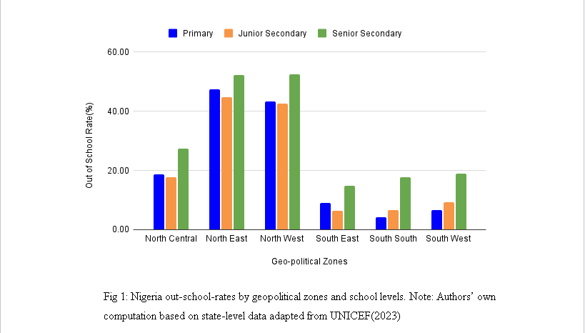
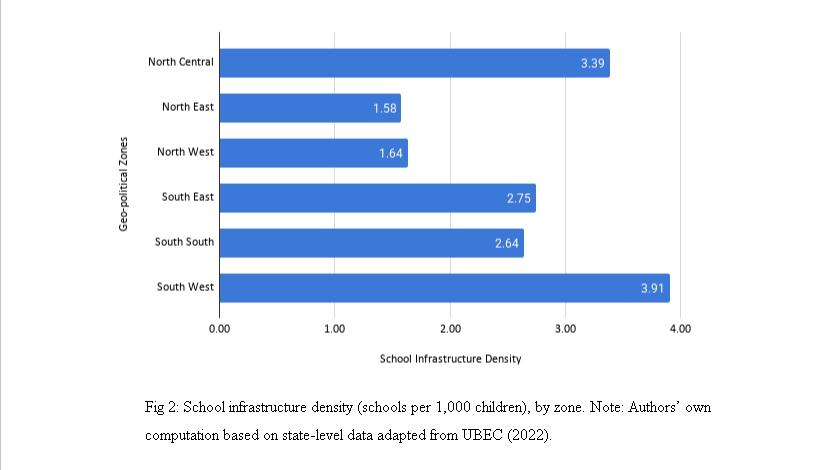

# nigeria-education-north-south-divide

---

## Table of Contents
1. [Project Overview](#project-overview)
2. [Problem Statement](#problem-statement)
3. [My Role](my-role)
4. [My Analytical Contribution](#my-analytical-contribution)
5. [Key Findings](#key-findings)
6. [My Recommendations](#my-recommendations)

---

## Project Overview 

This policy memo was an entry for the 2nd edition policy hackathon competition organised by the Political Science Department at Babcock University (POLSSA) and sponsored by Policy Shapers. The memo addresses the unequal access to pre-tertiary education between Nigeria's Northern and Southern regions, and was formally directed to Dr. Morufu Olatunji Alausa, Honourable Minister of Education, as a call to policy action.

**Title:** Uniform Policy, Unequal Access: A call to action to address the North-South divide in access to pre-tertiary education in Nigeria

**Team Name:** Team Literacy

**Team Members:** Adesoye Olamilekan Joshua (Team Leader), Ajibola Oluwademilade Benedict, Ezeh Jude Chukwuemeka, Nwazuluahu Brian, Nwofili Olisa Victor

**Tool Used for analysis:** Google Sheet

**Outcome:** 2nd Place

[View Full Policy Memo](report/team-lieracy-policy-memo.pdf)

---

## Problem Statement
Despite Nigeria's commitment to free and compulsory basic education under the Universal Basic Education (UBE) Act of 2004, the country holds the unfortunate record of having the highest number of out-of-school children in the world — 18.3 million children as of 2024 (UNICEF, 2024). This crisis is not evenly distributed. It falls heaviest on the North, where poverty, chronic underinvestment, insecurity, and deep-rooted gender norms work together to keep children — especially girls — out of school. In the North East and North West alone, nearly 66% of Nigeria's out-of-school children are concentrated, with girls' primary net attendance falling below 50% in both zones. Meanwhile, over N263 billion in UBEC matching grants sat unclaimed by December 2024 — not because the need does not exist, but because the states that need it most cannot meet the counterpart funding requirement. This memo argues that the North-South education divide is not a regional problem — it is a national emergency that demands urgent, structured policy intervention.

---

## My Role

I served as the team leader and personally worked on the Evidence and Analysis section - gathering and analysis section. I sourced and computed original data from UNICEF and UBEC datasets, analysed the data and visualized results in Fig 1 and Fig 2. I also interpreted the findings and contributed three of the five policy recommendations. 

---

## My Analytical Contribution

**1. Out-of-School Rates**
Analysed out-of-school rates across all six geopolitical zones using UNICEF state-level data and built Fig 1 (grouped bar chart) showing primary, junior, and senior secondary dropout rates by zone

**2. School Infrastructure Deficit**
Analysed school infrastructure density (schools per 1,000 children) using UBEC 2022 data and built Fig 2 (horizontal bar chart) revealing that a child in the North East has access to less than half the school infrastructure available in the South West

---

## Key Findings

1. North East and North West have out-of-school rates of 43–53% across all school levels which is significanly higher than south region. One in two school-age children in these zones is not in school. Also, all six geopolitical zones show a high out-of-school rate at the senior secondary school level - a finding that directly shaped Recommendation 5.
2. North West (1.64) and North East (1.58) show low density compared to South West (3.91) and South East (2.75) and this indicates a high school infrastructure deficit. A child that lives in the North East has access to less than half the school infrastructure that exists in the South West region.

---

## My Recommendations

1. Reform Funding Structure: Many states in the North cannot access UBE intervention funds due to weak economic power. Funding is crucial ensuring young children access to education as it finances school constructions, teacher training, and learning materials. Hence, much attention should be paid to this root cause of North-South divide.
1.1 Low IGR states in the North East and North West such as Yobe, Ebonyi, Kebbi, Taraba, Adamawa, e.t.c, should be given less strict conditional rules to access intervention funds. The compulsory counterpart contribution can be reduced from 50% to 20% for these states.
1.2 The HMoE should work with UBEC to plan adjustment and lobby National Assembly for approval
1.3 The Revenue Mobilization Allocation and Fiscal Commission (RMAFC) would then create a formula that prioritises states with low IGR, high out-of-school rates and high poverty index
2. A comprehensive research should be conducted : There is low availability of research and data on the North-South gap to access to education  in Nigeria, and other aspects of education at large. The statistical report on UBEC’s website which includes data on every aspect of education implementation only contains information up to 2022 and this contributes to lack of awareness of the several anomalies in the education sector. 
2.1 The Honorable Minister of Education (HMoE) should meet with UBEC and National Bureau of Statistics and discuss a plan to conduct a longitudinal data collection project. The budget should be designed to reflect the scale and scope of the projects and partnership should be secured with international organizations such as UNICEF, World Bank, and UNESCO Institute of Statistics to provide research assistance as it would be needed. 
3. Work towards increase of basic education to children aged 15-18 years: From figure 1, you would see that there is a universal pattern of high rate out-of-school children in the senior secondary level across all zones. This is no coincidence: the UBE policy only focuses on education up to junior secondary level and this has led to a large number of children not continuing school after the level. Although public senior secondary schools are under the jurisdiction of the state governments, most of them rely on the Federation Account Allocation Committee (FAAC) which limits the effectiveness of the program.    
5.1 The HMoE should conduct or commission an education sector review showing dropout rates at junior secondary level and transition gaps into senior secondary. 
5.2. The Ministry of Education must work with the National Assembly to amend the UBEC act (2004) to include funding-support for projects at senior secondary school level. Support could be subject to criteria such as purposeful project proposals from SUBEB.

